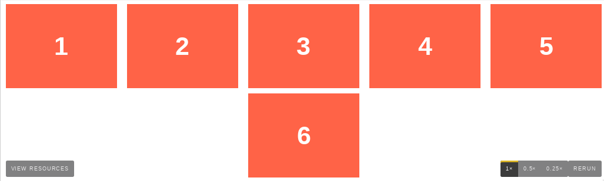
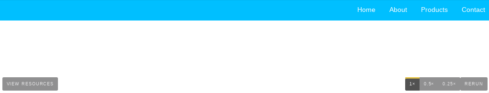
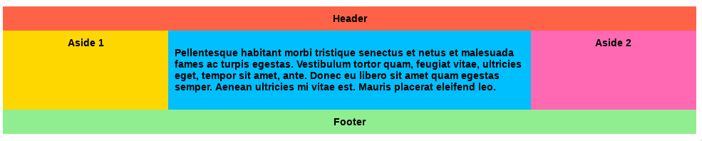

Let's start with a very very simple example, solving an almost daily problem: perfect centering. It couldn't be any simpler if you use flexbox.

	.parent {
	  display: flex;
	  height: 300px; /* Or whatever */
	}

	.child {
	  width: 100px;  /* Or whatever */
	  height: 100px; /* Or whatever */
	  margin: auto;  /* Magic! */
	}

This relies on the fact a margin set to `auto` in a flex container absorb extra space. So setting a vertical margin of auto will make the item perfectly centered in both axis.

Now let's use some more properties. Consider a list of 6 items, all with a fixed dimensions in a matter of aesthetics but they could be auto-sized. We want them to be evenly and nicely distributed on the horizontal axis so that when we resize the browser, everything is fine (without media queries!).

	.flex-container {
	  /* We first create a flex layout context */
	  display: flex;
	  
	  /* Then we define the flow direction 
	     and if we allow the items to wrap 
	   * Remember this is the same as:
	   * flex-direction: row;
	   * flex-wrap: wrap;
	   */
	  flex-flow: row wrap;
	  
	  /* Then we define how is distributed the remaining space */
	  justify-content: space-around;
	}

Done. Everything else is just some styling concern. Below is a pen featuring this example. Be sure to go to CodePen and try resizing your windows to see what happens.

Let's try something else. Imagine we have a right-aligned navigation on the very top of our website, but we want it to be centered on medium-sized screens and single-columned on small devices. Easy enough.

	/* Large */
	.navigation {
	  display: flex;
	  flex-flow: row wrap;
	  /* This aligns items to the end line on main-axis */
	  justify-content: flex-end;
	}
	
	/* Medium screens */
	@media all and (max-width: 800px) {
	  .navigation {
	    /* When on medium sized screens, we center it by evenly distributing empty space around items */
	    justify-content: space-around;
	  }
	}
	
	/* Small screens */
	@media all and (max-width: 500px) {
	  .navigation {
	    /* On small screens, we are no longer using row direction but column */
	    flex-direction: column;
	  }
	}

Let's try something even better by playing with flex items flexibility! What about a mobile-first 3-columns layout with full-width header and footer. And independent from source order.

	.wrapper {
	  display: flex;
	  flex-flow: row wrap;
	}
	
	/* We tell all items to be 100% width, via flex-basis */
	.wrapper > * {
	  flex: 1 100%;
	}
	
	/* We rely on source order for mobile-first approach
	 * in this case:
	 * 1. header
	 * 2. article
	 * 3. aside 1
	 * 4. aside 2
	 * 5. footer
	 */
	
	/* Medium screens */
	@media all and (min-width: 600px) {
	  /* We tell both sidebars to share a row */
	  .aside { flex: 1 auto; }
	}
	
	/* Large screens */
	@media all and (min-width: 800px) {
	  /* We invert order of first sidebar and main
	   * And tell the main element to take twice as much width as the other two sidebars 
	   */
	  .main { flex: 2 0px; }
	  .aside-1 { order: 1; }
	  .main    { order: 2; }
	  .aside-2 { order: 3; }
	  .footer  { order: 4; }
	}

	

