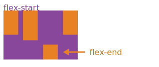

## background

The Flexbox Layout (Flexible Box) module (currently a W3C Last Call Working Draft) aims at providing a more efficient way to lay out, align and distribute space among items in a container, even when their size is unknown and/or dynamic (thus the word "flex").

The main idea behind the flex layout is to give the container the ability to alter its items' width/height (and order) to best fill the available space (mostly to accommodate to all kind of display devices and screen sizes). A flex container expands items to fill available free space, or shrinks them to prevent overflow.

Most importantly, the flexbox layout is direction-agnostic as opposed to the regular layouts (block which is vertically-based and inline which is horizontally-based). While those work well for pages, they lack flexibility (no pun intended) to support large or complex applications (especially when it comes to orientation changing, resizing, stretching, shrinking, etc.).

Note: Flexbox layout is most appropriate to the components of an application, and small-scale layouts, while the Grid layout is intended for larger scale layouts.

## Base and terminalogy

Since flexbox is a whole module and not a single property, it involves a lot of things including its whole set of properties. Some of them are meant to be set on the container (parent element, known as "flex container") whereas the others are meant to be set on the children (said "flex items").

If regular layout is based on both block and inline flow directions, the flex layout is based on "flex-flow directions". Please have a look at this figure from the specification, explaining the main idea behind the flex layout.

Basically, items will be laid out following either the main axis (from main-start to main-end) or the cross axis (from cross-start to cross-end).

- main axis - The main axis of a flex container is the primary axis along which flex items are laid out. Beware, it is not necessarily horizontal; it depends on the flex-direction property (see below).
- main-start | main-end - The flex items are placed within the container starting from main-start and going to main-end.
- main size - A flex item's width or height, whichever is in the main dimension, is the item's main size. The flex item's main size property is either the ‘width’ or ‘height’ property, whichever is in the main dimension.
- cross axis - The axis perpendicular to the main axis is called the cross axis. Its direction depends on the main axis direction.
- cross-start | cross-end - Flex lines are filled with items and placed into the container starting on the cross-start side of the flex container and going toward the cross-end side.
- cross size - The width or height of a flex item, whichever is in the cross dimension, is the item's cross size. The cross size property is whichever of ‘width’ or ‘height’ that is in the cross dimension.

## Container

### display

This defines a flex container; inline or block depending on the given value. It enables a flex context for all its direct children.

	.container {
	  display: flex; /* or inline-flex */
	}
	
	{
		type: 'Group'
	}

Note that CSS columns have no effect on a flex container.

### flex-direction

This establishes the main-axis, thus defining the direction flex items are placed in the flex container. Flexbox is (aside from optional wrapping) a single-direction layout concept. Think of flex items as primarily laying out either in horizontal rows or vertical columns.

- row 
- column

	.container {
	  flex-direction: row | row-reverse | column | column-reverse;
	}
	
	{
		type: 'Group'
		style: {
			layout: {
				direction: 'row'
			}
		}
	}
	
row (default): left to right in ltr; right to left in rtl
row-reverse: right to left in ltr; left to right in rtl
column: same as row but top to bottom
column-reverse: same as row-reverse but bottom to top

### flex-wrap

By default, flex items will all try to fit onto one line. You can change that and allow the items to wrap as needed with this property.
	
	.container{
	  flex-wrap: nowrap | wrap | wrap-reverse;
	}
	
	
	{
		type: 'Group'
		style: {
			layout: {
				direction: 'row',
				wrap: true
			}
		}
	}
	

nowrap (default): all flex items will be on one line
wrap: flex items will wrap onto multiple lines, from top to bottom.
wrap-reverse: flex items will wrap onto multiple lines from bottom to top.
There are some visual demos of flex-wrap here.

### justify-content

This defines the alignment along the main axis. It helps distribute extra free space left over when either all the flex items on a line are inflexible, or are flexible but have reached their maximum size. It also exerts some control over the alignment of items when they overflow the line.

	.container {
	  justify-content: flex-start | flex-end | center | space-between | space-around | space-evenly;
	}
	
	{
		type: 'Group'
		style: {
			layout: {
				direction: 'row',
				wrap: true,
				justify: 'center'
			}
		}
	}

flex-start (default): items are packed toward the start line
flex-end: items are packed toward to end line
center: items are centered along the line
space-between: items are evenly distributed in the line; first item is on the start line, last item on the end line
space-around: items are evenly distributed in the line with equal space around them. Note that visually the spaces aren't equal, since all the items have equal space on both sides. The first item will have one unit of space against the container edge, but two units of space between the next item because that next item has its own spacing that applies.
space-evenly: items are distributed so that the spacing between any two items (and the space to the edges) is equal.

### align-items

This defines the default behaviour for how flex items are laid out along the cross axis on the current line. Think of it as the justify-content version for the cross-axis (perpendicular to the main-axis).

	.container {
	  align-items: flex-start | flex-end | center | baseline | stretch;
	}
	
	{
		type: 'Group'
		style: {
			layout: {
				direction: 'row',
				wrap: true,
				justify: 'center',
				align: 'center'
			}
		}
	}
flex-start: cross-start margin edge of the items is placed on the cross-start line
flex-end: cross-end margin edge of the items is placed on the cross-end line
center: items are centered in the cross-axis
baseline: items are aligned such as their baselines align
stretch (default): stretch to fill the container (still respect min-width/max-width)

### align-content

This aligns a flex container's lines within when there is extra space in the cross-axis, similar to how justify-content aligns individual items within the main-axis.

Note: this property has no effect when there is only one line of flex items.

	.container {
	  align-content: flex-start | flex-end | center | space-between | space-around | stretch;
	}
	
	
	{
		type: 'Group'
		style: {
			layout: {
				direction: 'row',
				wrap: true,
				justify: 'center',
				align: 'center'
			}
		}
	}

flex-start: lines packed to the start of the container
flex-end: lines packed to the end of the container
center: lines packed to the center of the container
space-between: lines evenly distributed; the first line is at the start of the container while the last one is at the end
space-around: lines evenly distributed with equal space around each line
stretch (default): lines stretch to take up the remaining space

## Item

### order

By default, widgets are laid out in the source order. However, the order property controls the order in which they appear in the parent group.

	{
		style: {
			layout: {
				order: <integer>; /* default is 0 */
			}
		}
	}

### grow

This defines the ability for a widget to grow if necessary. It accepts a unitless value that serves as a proportion. It dictates what amount of the available space inside the parent group the widget should take up.

If all widgets have grow set to 1, the remaining space in the group will be distributed equally to all children. If one of the children has a value of 2, the remaining space would take up twice as much space as the others (or it will try to, at least).

	{
		style: {
			layout:{
				grow: <number>; /* default 0 */
			}
		}
	}

Negative numbers are invalid.

### shrink

This defines the ability for a widget item to shrink if necessary.

	{
		style:{
			layout:{
				shrink: <number>; /* default 1 */
			}
		}
	}

Negative numbers are invalid.

### basis

This defines the default size of an widget before the remaining space is distributed. It can be a length (e.g. 20%, 5rem, etc.) or a keyword. The auto keyword means "look at my width or height property" (which was temporarily done by the main-size keyword until deprecated). The content keyword means "size it based on the item's content" - this keyword isn't well supported yet, so it's hard to test and harder to know what its brethren max-content, min-content, and fit-content do.

	{
		style: {
			layout: {
				basis: <length> | auto; /* default auto */
			}
		}
	}

If set to 0, the extra space around content isn't factored in. If set to auto, the extra space is distributed based on its grow value. See this graphic.

### align-self

This allows the default alignment (or the one specified by align-items) to be overridden for individual flex items.

Please see the align-items explanation to understand the available values.

	.item {
	  align-self: auto | flex-start | flex-end | center | baseline | stretch;
	}

Note that float, clear and vertical-align have no effect on a flex item.

## Browser Support

Broken up by "version" of flexbox:

(new) means the recent syntax from the specification (e.g. display: flex;)
(tweener) means an odd unofficial syntax from 2011 (e.g. display: flexbox;)
(old) means the old syntax from 2009 (e.g. display: box;)
Chrome	Safari	Firefox	Opera	IE	Edge	Android	iOS
20- (old)
21+ (new)	3.1+ (old)
6.1+ (new)	2-21 (old)
22+ (new)	12.1+ (new)	10 (tweener)
11+ (new)	17+ (new)	2.1+ (old)
4.4+ (new)	3.2+ (old)
7.1+ (new)
Blackberry browser 10+ supports the new syntax.

For more informations about how to mix syntaxes in order to get the best browser support, please refer to this article (CSS-Tricks) or this article (DevOpera).	

## Java Swing support

See: https://www.google.com/search?q=java+float+layout&oq=java+float+layout&aqs=chrome..69i57j0j69i61l2j0l2.8651j0j7&sourceid=chrome&ie=UTF-8

## Java SWT support

See: https://www.eclipse.org/articles/Article-Understanding-Layouts/Understanding-Layouts.htm

https://help.eclipse.org/mars/index.jsp?topic=%2Forg.eclipse.wb.rcp.doc.user%2Fhtml%2Flayoutmanagers%2Fswt%2Frowlayout.html

## Qt support

See: http://doc.qt.io/qt-5/qtwidgets-layouts-flowlayout-example.html
